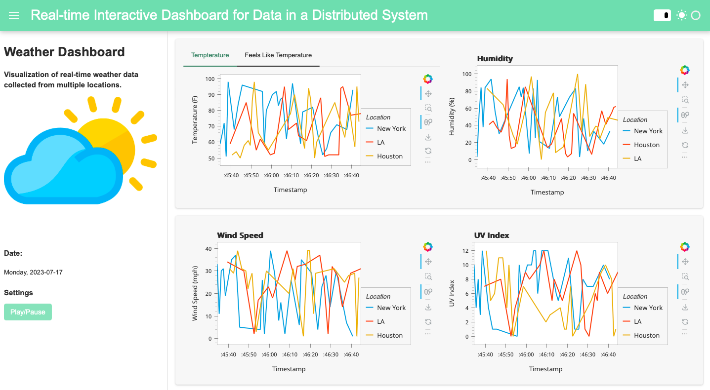

# Real-time Interactive Dashboard for Distributed Systems

This repository contains the code for real-time visualization dashboard for a distributed system using Python.

## Instructions

### Setup

* **Python version: 3.11** 

### Instal Requirements

```commandline
pip install -r requirements.txt
```

### Publisher Client

As a proof-of-concept we use a sample application of visualizing real-time weather data collected from multiple publishers in a distributed system. We provide a Publisher client which can be used to connect to the MQTT broker, subscribe to a topic, and publish the weather data into the topic.

In each producer in the distributed system, you can import PublisherClient from publisher_client.py, connect, and publish data as below. 
```commandline
from publisher_client import PublisherClient

publisher = PublisherClient.connect()
publisher.publish(payload)
```

* Run sample weather data publisher at `sample_weather_data_publisher.py`

### Dashboard Client

We implemented a dashboard client that allows our real-time weather data visualization application to connect to the MQTT broker, subscribe to a topic, receive weather data from publisher devices, emit the data into the data stream, and visualize the data in an interactive dashboard.

* Run the dashboard client at `dashboard_client.py`

### Sample Visualization Dashboard

